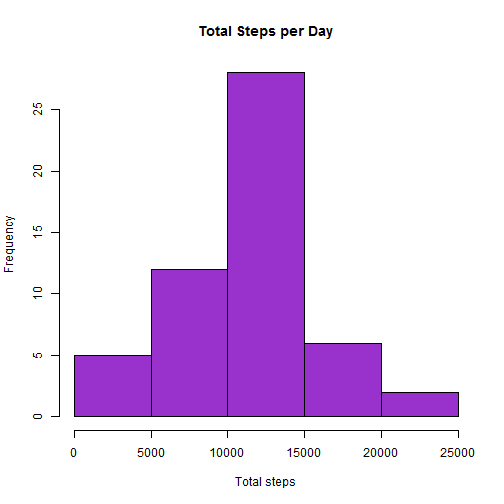
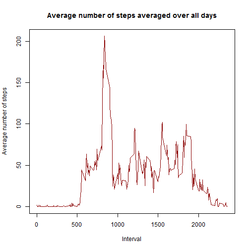
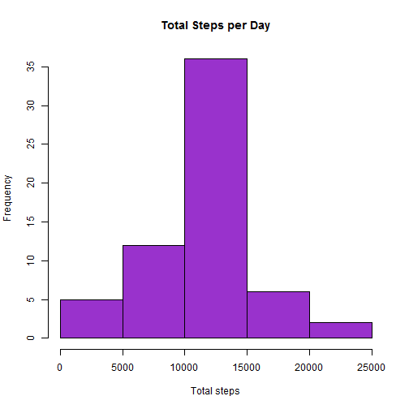

###Loading and preprocessing the data.

1. Load the data


```r
# unzip file 
if (!file.exists("Amd.zip")) {
        download.file(url="https://d396qusza40orc.cloudfront.net/repdata%2Fdata%2Factivity.zip",
                      destfile="Amd.zip")
        unzip("Amd.zip")  
}

# read csv-file 
data <- read.csv("activity.csv", sep=",", stringsAsFactors=FALSE)
str(data)
```

```
## 'data.frame':	17568 obs. of  3 variables:
##  $ steps   : int  NA NA NA NA NA NA NA NA NA NA ...
##  $ date    : chr  "2012-10-01" "2012-10-01" "2012-10-01" "2012-10-01" ...
##  $ interval: int  0 5 10 15 20 25 30 35 40 45 ...
```

2. Process the data into a format suitable for the next analysis


```r
# sum values by date
sum<-lapply(split(data$steps, data$date), sum)
sum2<-as.table(as.numeric(sum))
rownames(sum2)<-unique(data$date)
```

###What is mean total number of steps taken per day?

1. Make a histogram of the total number of steps taken each day


```r
# construct the histogram
hist(sum2, main = "Total Steps per Day", xlab="Total steps", col="darkorchid")
```

 

2. Calculate and report the mean and median total number of steps taken per day


```r
sum2<-as.numeric(sum2)

# Calculate mean value
mean(sum2, na.rm=TRUE)
```

```
## [1] 10766.19
```

```r
# Calculate median value
median(sum2, na.rm=TRUE)
```

```
## [1] 10765
```

###What is the average daily activity pattern?

1. Make a time series plot (i.e. type = "l") of the 5-minute interval (x-axis) and the average number of steps taken, averaged across all days (y-axis)


```r
# aggregate steps as interval to get average number of steps in an interval across all days
interval_steps <- aggregate(steps ~ interval, data, mean)

# generate the line plot of the 5-minute interval (x-axis) and the average number of 
# steps taken, averaged across all days (y-axis)
plot(interval_steps, type='l', main="Average number of steps averaged over all days", xlab="Interval", ylab="Average number of steps", col="darkred")
```

 

2. Which 5-minute interval, on average across all the days in the dataset, contains the maximum number of steps?


```r
maxInterval<-subset(interval_steps$interval, interval_steps$steps==max(interval_steps$steps))
print(maxInterval)
```

```
## [1] 835
```

###Imputing missing values

1. Calculate and report the total number of missing values in the dataset (i.e. the total number of rows with NAs)


```r
sum(is.na(data$steps))
```

```
## [1] 2304
```

2. Devise a strategy for filling in all of the missing values in the dataset. The strategy does not need to be sophisticated. For example, you could use the mean/median for that day, or the mean for that 5-minute interval, etc.


```r
#Na replaced by mean in 5 min interval
filling <- numeric()
for (i in 1:nrow(data)) {
    calc <- data[i, ]
    if (is.na(calc$steps)) {
        steps <- subset(interval_steps, interval == calc$interval)$steps
    } else {
        steps <- calc$steps
    }
    filling <- c(filling, steps)
}
```
3.Create a new dataset that is equal to the original dataset but with the missing data filled in.


```r
#Create a new dataset
new_data<-data
new_data$steps<-filling

#check
colSums(is.na(new_data))
```

```
##    steps     date interval 
##        0        0        0
```

4. Make a histogram of the total number of steps taken each day and Calculate and report the mean and median total number of steps taken per day. Do these values differ from the estimates from the first part of the assignment? What is the impact of imputing missing data on the estimates of the total daily number of steps?


```r
total_day<-tapply(new_data$steps, new_data$date, sum)
# construct the histogram
hist(total_day, main = "Total Steps per Day", xlab="Total steps", col="darkorchid")
```

 

```r
sum<-as.numeric(total_day)

# Calculate mean value
mean(sum)
```

```
## [1] 10766.19
```

```r
# Calculate median value
median(sum)
```

```
## [1] 10766.19
```

After replacing the mean is the same but the median is a little bit different

###Are there differences in activity patterns between weekdays and weekends?

1. Create a new factor variable in the dataset with two levels – “weekday” and “weekend” indicating whether a given date is a weekday or weekend day.


```r
data<-new_data
day <- weekdays(as.Date(data$date))
daytype <- vector()
for (i in 1:nrow(data)) {
    if (day[i] == "ñóáîòà") {
        daytype[i] <- "Weekend"
    } else if (day[i] == "íåä³ëÿ") {
        daytype[i] <- "Weekend"
    } else {
        daytype[i] <- "Weekday"
    }
}
data$daytype <- daytype
data$daytype <- factor(data$daytype)
```

2. Make a panel plot containing a time series plot (i.e. type = "l") of the 5-minute interval (x-axis) and the average number of steps taken, averaged across all weekday days or weekend days (y-axis).


```r
library(lattice)
stepsByDay <- aggregate(steps ~ interval + daytype, data = data, mean)
names(stepsByDay) <- c("interval", "daytype", "steps")

xyplot(steps ~ interval | daytype, stepsByDay, type = "l", layout = c(1, 2), 
    xlab = "Interval", ylab = "Number of steps")
```

 
